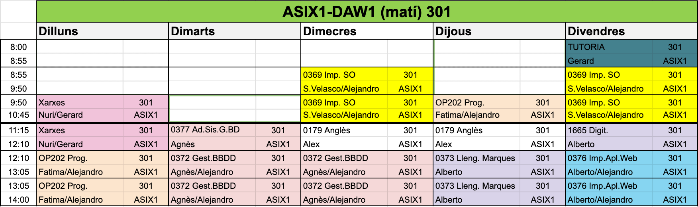
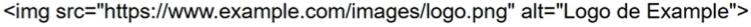
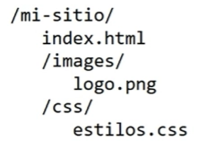

# ASIX1-apuntes-SergiNebot
# Capitulo 1 ``GitHub``

Para clonar el repositorio que hemos creado, primero tendremos que crear una carpeta local en la que querramos guardar el repositorio, y despues iremos al cmd de la carpeta en la que queramos guardar ese repositorio y luego escribiremos lo siguiente:
``git clone (url)``

Cuando queramos hacer una copia de seguridad tendremos que seguir los siguientes pasos:
```
git init
git branch (para saber en que rama esta el repositorio)
git branch -M main (es por si no funciona y despues de haber ejecutado este comando tendriamos volver a poner el git branch)
git add (añadir archivos que se van a subir)
git commit -m (mensaje) "Texto de lo que hemos modificado" (Para guardar los cambios)
git push origin main
```

# Capitulo 2 ```Markdown```
## Segundo nivel de encabezado
### Tercer nivel de encabezado
#### Cuarto nivel de encabezado
###### Quinto nivel de encabezado
###### Sexto nivel de encabezado
Apuntes para **lenguaje de marcas**

Las etiquetas en **_markdown_** y **_HTML_** pueden anidarse
El "#" genera encabezados

Para poner la letra en negrita se tendran que poner dos ** al principio y al final. 
Ejemplo:
**Texto que quieras añadir**

Para ponerlo en cursiva se puede poner de las siguientes formas:

``*Texto que quieras añadir*``

``_Texto que quieras añadir_``

Y si quieres poner la palabra en cursiva y negrita a la vez se tendran que poner de la siguiente forma:

``**_Texto que quieras añadir _**``


1. Primer punto de la lista
    1. Primer elemento de la sublita 1
    2. Segundo elemento de la sublista 1
2. segundo punto de la lista
    * Primer elemento de la sublista 2
    * Segundo elemento de la sublista 2
3. Tercer punto de la lista


* Primer punto
- Segundo Punto
+ Tercer punto

**Como mosotras codigo en un repositorio**
```
<!DOCTYPE html>
<html lang="en">
<head>
    <meta charset="UTF-8">
    <meta name="viewport" content="width=device-width, initial-scale=1.0">
    <title>Document</title>
</head>
<body>
    
</body>
</html>
```

### Como poner un link

[TextoClicable](URL "Titulo Opcional")

Ejemplo:

[Página web de Jesuïtes Bellvitge](https://www.fje.edu/ca/jesuites-bellvitge "Titulo Opcional")

### Como poner una imagen



### Tablas
| Titulo 1 | Titulo 2 | Titulo 3 |
|----------|:--------------:|--------------:|
| **SMX2** | Curso 2324 | 25 |
| **ASIX1** | curso 2425 | 33 |
|**DAW2** | curso 2425 | 32 |


# Capitulo 2 ```HTML```

## Introducción HTML

- HTML (HyperText Markup Languaje) es el lenguaje de marcado estandar para crear páginas web. **Languaje de internet dado que sin html no se veria nada en el navegador web**

- Markup significa marca o etiqueta, ya que **todas las páginas web estan construidas en base a etiquetas**, desde las primeras versiones hasta las últimas etiquetas de **HTML5**.

- Languaje 

## Introducción a HTML (elementos)

## Introducción a HTML (atributos)

Los elementos tambien pueden tener **atributos**

Los atributos contienen información adicional acerca del elemento, la cual no quieres que aparezca en el contenido real del elemento. 

Los atributos siempre incluyen en la etiqueta de apertura de un elemento y deben tener siempre:

- Un espacio entre este y el nombre del elemento.
  
- El nombre del atributo, seguido por un signo de igual (=).
  
- Comillas de apertura y de cierre, encerrando el valor del atributo.
  
## Estructura basica de un fichero HTML

- Una página HTML incluye una declaración DOCTYPE, un elemento html, y dentro de este, un head y un body.
  
- El head contiene metadatos y enlaces a hojas de estilo y scripts, mientras el body contiene el contenido principal de la página web.

## Elementos de bloque y linea

## Resumen de normas básicas de etiquetas HTML

- Las etiquetas HTML  normalmente vienen en pares, con una etiqueta de apertura y una de cierre.

## Legibilidad y organización de código

La legibilidad del codigo fuente es la claridad con lo que esta modificado.

## Comentarios

## Introducción del codigo

## Organización de los archivos

## Etiquetas basicas de HTML

Las listas de definicion se caracterizan por ser una enumeracion de definiciones de terminos.

En HTML, cuando necesitamos enlazar a otros archivos, ya sean documentos HTML, hojas de estilo css o imagenes, podemos usar rutas para especificar la ubicación de estos archivos. Existen dos tipos de rutas:

- **Ruta Absoluta**
  <br>
  Una ruta absoluta especifica la ubicación completa del archivo en la web, comenzando desde el dominio.
  
  
  
- **Ruta Relativa**
  <br>
  Una ruta relativa especifica la ubicación del archivo en relacion con la ubicacion del documento actual.

  


- **Imagenes**
<br>
  Las imagenes son un recurso son un recurso muy utilizados en el desarrollo web.

  