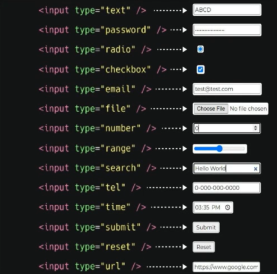
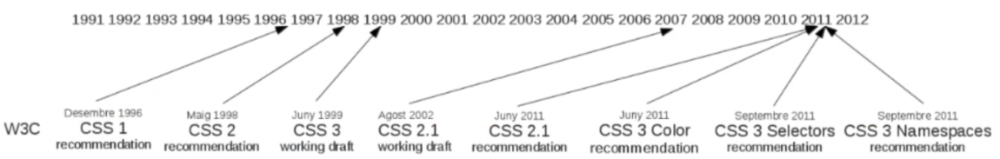
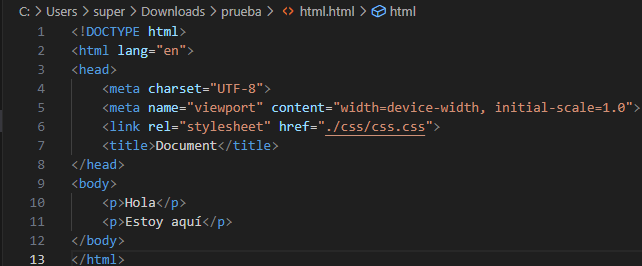
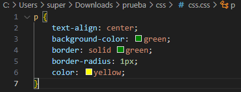
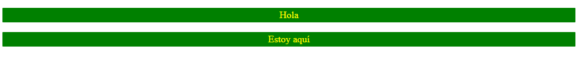

# ASIX1-apuntes-SergiNebot
# Capitulo 1 ``GitHub``

## Que es ``Github?``
Es un Sistema de control de versiones, que nos ayuda a llevar un historial completo de modificaciónes y avances que realizamos en proyectos.
## Caracteristicas de GitHub
1. Funciona como una maquina del tiempo (Por las copias de seguridad que hayamos subido)
2. Trabaja con ramas (permite sacar bifuracciones para no comprometes a la rama principal)
3. Trabaja de forma colaborativa
## Como clonar repositorios de GitHub?
Para clonar el repositorio que hemos creado, primero tendremos que crear una carpeta local en la que querramos guardar el repositorio, y despues iremos al cmd de la carpeta en la que queramos guardar ese repositorio y luego escribiremos lo siguiente:
``git clone (url)``

### Como subir una copia de seguridad al GitHub?

Cuando queramos hacer una copia de seguridad tendremos que entrar en el cmd dentro de la carpeta que se nos haya creado al clonar el repositorio y luego escribiremos los sigiuientes comandos en el orden en el que estan:
```
git init
git branch (para saber en que rama esta el repositorio)
git branch -M main (es por si no funciona y despues de haber ejecutado este comando tendriamos volver a poner el git branch)
git add (añadir archivos que se van a subir ("."=todos los archivos))
git commit -m (mensaje) "Texto de lo que hemos modificado" (Para guardar los cambios)
git push origin main
```

# Capitulo 2 ```Markdown```
```
## Segundo nivel de encabezado
### Tercer nivel de encabezado
#### Cuarto nivel de encabezado
###### Quinto nivel de encabezado
###### Sexto nivel de encabezado
```

Las etiquetas en **_markdown_** y **_HTML_** pueden anidarse
El "#" genera encabezados

Para poner la letra en negrita se tendran que poner dos ** al principio y al final. 
Ejemplo:
```**Texto que quieras añadir**```

Para ponerlo en cursiva se puede poner de las siguientes formas:

```*Texto que quieras añadir*```

```_Texto que quieras añadir_```

Y si quieres poner la palabra en cursiva y negrita a la vez se tendran que poner de la siguiente forma:

```**_Texto que quieras añadir _**```


1. Primer punto de la lista
    1. Primer elemento de la sublita 1
    2. Segundo elemento de la sublista 1
2. segundo punto de la lista
    * Primer elemento de la sublista 2
    * Segundo elemento de la sublista 2
3. Tercer punto de la lista


* Primer punto
- Segundo Punto
+ Tercer punto

**Como mosotras codigo en un repositorio**

Tendremos que colocar el codigo dentro de ``` y luego volver a cerrarlo con lo mismo con lo que lo hemos abierto

```
<!DOCTYPE html>
<html lang="en">
<head>
    <meta charset="UTF-8">
    <meta name="viewport" content="width=device-width, initial-scale=1.0">
    <title>Document</title>
</head>
<body>
    
</body>
</html>
```

### Como poner un link
Para poner un link tendremos que colocarlo como el siguiente ejemplo:

```
[TextoClicable](URL "Titulo Opcional")
```
Ejemplo:
```
[Página web de Jesuïtes Bellvitge](https://www.fje.edu/ca/jesuites-bellvitge "Titulo Opcional")
```
[Página web de Jesuïtes Bellvitge](https://www.fje.edu/ca/jesuites-bellvitge "Titulo Opcional")
### Como poner una imagen

``````


### Tablas
Para hacer una tabla tenemos que poner los titulos entre ```||```, para justificar el texto tendremos que poner:
- |----------| : Sirve para 
- |:--------------:| :
- |--------------:| :
```
| Titulo 1 | Titulo 2 | Titulo 3 |
|----------|:--------------:|--------------:|
| **SMX2** | Curso 2324 | 25 |
| **ASIX1** | curso 2425 | 33 |
|**DAW2** | curso 2425 | 32 |
```

| Titulo 1 | Titulo 2 | Titulo 3 |
|----------|:--------------:|--------------:|
| **SMX2** | Curso 2324 | 25 |
| **ASIX1** | curso 2425 | 33 |
|**DAW2** | curso 2425 | 32 |

# Capitulo 3 ```HTML```

## Introducción HTML

- **HTML (HyperText Markup Languaje)** es el lenguaje de marcado estandar para crear páginas web. **Languaje de internet dado que sin html no se veria nada en el navegador web**

- **Markup** significa marca o etiqueta, ya que **todas las páginas web estan construidas en base a etiquetas**, desde las primeras versiones hasta las últimas etiquetas de **HTML5**.

- **Languaje** significa lenjuage, un ejemplo seria **HTML** que es un lenguaje, tiene sus normas, estructura y una serie de convenciones que sirven para definir tanto como la estructura como el contenido de una web. Es importante saber que aunque HTML sea un lenjuage no se refiere a que es uno de programación, y no lo es porque no tiene estructuras de lenjuage de programación (los bucles, las condiciones, funciones, etc...)

## Introducción a HTML (elementos)
- **HTML no es un lenguaje de programación**, es un lenguaje de marcado que define la estructura de su contenido.
- Esto implica que la información a mostrar ha de ir "etiquetados" para formar elementos que el navegador web sepa interpretar de qué tipo de información se trata y como tal sepa cómo representarlos.
- Las partes principales del elemento son:

  - Etiqueta de apertura: consiste en el nombre del elemento y esta encerrado por paréntesis angulares (<>)
  
  - La etiqueta de cierre: es igual que la etiqueta de apertura, excepto que incluye una barra de cierre ( / )

  - El contenido: este es el contenido del elemento, que en este caso es sólo texto.


  - El elemento: la etiqueta de apertura, más la etiqueta de cierre, más el contenido equivale al elemento.

## Introducción a HTML (atributos)

Los elementos tambien pueden tener **atributos**

Los atributos contienen información adicional acerca del elemento, la cual no quieres que aparezca en el contenido real del elemento. 

Los atributos siempre incluyen en la etiqueta de apertura de un elemento y deben tener siempre:

- Un espacio entre este y el nombre del elemento.
  
- El nombre del atributo, seguido por un signo de igual (=).
  
- Comillas de apertura y de cierre, encerrando el valor del atributo.
  
## Validacion en HTML

La **validacion de HTML** es un proceso para verificar que el codigo HTML cumple con los requisitos establecidos por el **World Wide Web Constrium (W3C)**, tambien ayuda a correguir errores que pueden causar problemas en la visualización en diferentes navegadores.

Para realizar la validación tendremos que copiar nuestro codigo html y pegarlo en el validador o tambien se puede hacer subiendo directamente el archivo.

## Estructura basica de un fichero HTML

Una página HTML incluye una declaración DOCTYPE, un elemento html, y dentro de este, un head y un body.
  
El head contiene metadatos y enlaces a hojas de estilo y scripts, mientras el body contiene el contenido principal de la página web.

## Elementos de bloque y linea
Dentro del cuerpo del documento debemos incluir todo el contenido de la web, la información que queremos que vea el usuario final de la web.

- **Elementos de bloque**
  Son grandes estructuras que contienen otros elementos de bloque, elementos de linea y de texto. Ejemplos de elementos de bloque los titulos, parrafos, las listas o las tablas:<br>
  ```<h1> - <h6> (encabezado), <p> (párrafo), <br> (salto de línea), <hr> (separador), <blockquote> (cita), <pre> (texto preformateado), <div> (división)```

- **Elementos de línea**
  Son pequeñas estructuras que representan o describen pequeños trozos de texto o datos.
  Ejemplos de elementos de línea los hipervínculos, las citas o las imágenes:<br>
  ```<em> (énfasis/cursiva), <strong> (fuerte énfasis/negrita), <q> (citas cortas), <span> (rango), <cite>, <abbr>, <code>```

## Resumen de normas básicas de etiquetas HTML

Las etiquetas HTML normalmente vienen en pares, con una etiqueta de apertura y una de cierre, por ejemplo ```<p> y </p>```

Algunas etiquetas, conocidas como etiquetas vacías, no tienen una etiqueta de cierre, como ```, <br> y <input>.```

Las etiquetas HTML deben anidarse correctamente. Por ejemplo, si una etiqueta ```<b>``` se abre dentro de una etiqueta ```<p>``` debe cerrarse antes de que se cierre la etiqueta ```<p>```.

## Legibilidad y organización de código

La legibilidad del codigo fuente es la claridad con lo que esta modificado.

Debemos pensar que normalmente no trabajaremos solos y hacer que lo que hemos desarrollado sea legible puede ayudar a aquellos que trabajan con nuestro documento a entender qué hemos hecho y por qué lo hemos hecho. 

Hay varias técnicas para que el código sea legible y esté bien organizado:

- los comentarios.
- la indentación del código.
- la organización de los archivos.

## Comentarios

En un documento HTML podemos poner anotaciones que no se verán reflejadas cuando se mire la web con el navegador, pero que son útiles para el desarrollador web.

La sintaxis del comentario html es el siguiente:
```<!--comentarios que queramos escribir-->```

Es muy importante comentar el codigo fuente, sobre todo si el documento es muy largo.

## Introducción del codigo

El código HTML está lleno de etiquetas que se abren y se cierran, el navegador web que interpretará este código no necesita que haya ni saltos de página ni tabuladores para poder interpretarlo, pero los seres humanos necesitamos que el código esté organizado con saltos de línea e indentaciones para poder leerlo de una manera cómoda.

Una técnica para indentar el código es que todo el contenido que hay entre una etiqueta de inicio y su correspondiente etiqueta de cierre esté indentado.

## Organización de los archivos

Cuando la aplicación web es muy grande tendrá varios archivos con extensión ```.html, hojas de estilo con extensión .css, imágenes, videos...```. Si tenemos todos estos archivos mezclados. nuestra aplicación web tenderá al caos.

**Debemos organizar nuestra aplicación en directorios.**

Es muy recomendable que cada vez que creemos una aplicación web creemos un directorio principal donde dejaremos todos nuestros archivos. En el caso del ejemplo lo hemos llamado web.

Es recomendable que el archivo de inicio de las aplicaciones tenga el nombre index.html. Esto hace que el usuario no tenga que escribir el nombre del archivo para acceder a el.

## Etiquetas basicas de HTML

Las listas de definicion se caracterizan por ser una enumeracion de definiciones de terminos.

En HTML, cuando necesitamos enlazar a otros archivos, ya sean documentos HTML, hojas de estilo css o imagenes, podemos usar rutas para especificar la ubicación de estos archivos. Existen dos tipos de rutas:

- **Ruta Absoluta**
  <br>
  Una ruta absoluta especifica la ubicación completa del archivo en la web, comenzando desde el dominio.
  
  
  
- **Ruta Relativa**
  <br>
  Una ruta relativa especifica la ubicación del archivo en relacion con la ubicacion del documento actual.

  


- **Imagenes**<br>
  Las imagenes son un recurso son un recurso muy utilizados en el desarrollo web. Ademas de hacer ,as atractiva nuestra aplicación, nos permite proporcionar información de manera visual.<br><br>
  Usamos el atributo src para indicar dónde está ubicada la imagen:<br>
  Podemos poner una URL externa o la ruta del archivo si tenemos la imagen localmente.

- **Enlaces (```<a>```)**<br>
  El éxito de la **WWW (World Wide Web)** es la capacidad de sallar de un documento a otro mediante enlaces. El sistema que nos permite esta navegacion se llama **hipertexto**. La etiqueta HTML para crear estos enlaces es ```<a>```. Es una etiqueta de línea, ya que podemos colocar enlaces rodeados de texto.

- **Enlaces a páginas externas**<br>
  Si queremos hacer un enlace a una página externa a nuestra aplicación web, como por ejemplo para enlazar al sitio web https://m.joan23.fje.edu/, pero el texto que queremos que aparezca en el navegador es implemente "Jesuïtes Bellvitge — Joan XXIII". EI código que debemos introducir es el siguiente: ```<p><a href="https://m.joan23.fje.edu/" title="Joan XXIII">Jesuïtes Bellvitge — Joan XXIII</a></p>```

- **Enlaces a páginas locales**<br>
  Si el enlace que queremos hacer está dirigido a un documento local nuestro, podemos usar la ruta relativa al archivo al cual queremos enlazar en el atributo href.
  Por ejemplo:

  ```
  <div id="menu">
  <a href="index.html" title="Volver a la página de inicio">Inicio</a>
  <a href="secciones/presentaciones.html" title="Fotos de la web">Presentaciones</a>
  <a href="secciones/actividades.html" title="Actividades actuales">Actividades</a>
  </div>
  ```
- **Listas**<br>
  Las listas desordenadas son aquellas en las que el orden de los ítems no es relevante, como en una lista de compras. Estas son encerradas en un elemento ```<ul> (unordered list)```. Se puede escoger el símbolo tipográfico indicandolo en la etiqueta Las opciones posibles son:
  - ```<ul type=Disc>```<br>
  - ```<ul type=square>```<br>
  - ```<<ul type=circle>```<br>

  Las listas ordenadas son aquellas en las que el orden sí es relevante, como en una receta. Estas son encerradas en un elemento ```<ol> (ordered list)```. Se puede escoger el tipo al enumerar una lista, por defecto es numérica y las otras opciones disponibles son:
  - ```<ol type=A>```<br>
  - ```<ol type=a>```<br>
  - ```<ol type=l>```<br>
  - ```<ol type=i start=10>```<br>
  - ```<ol type=l>```<br>
  
  Añadiendo el parámetro start=n se fuerza la numeración a partir de un determinado valor. 
  
  Añadiendo el parámetro value=n se fuerza a que el elemento tenga el número de orden que indiquemos.
  
  Cada elemento de la lista se coloca dentro de un elemento ```<li> (list item)```.

## Elementos Semánticos en HTML 5

Es la clave de saber usar HTML correctamente. ```<span>``` permite agrupar contenido en línea y ```<div>``` contenido en bloque. Pero no aporta un valor semántico.<br><br>
El **HTML SEMÁNTICO consique en describir el contenido dándole un significado de forma correcta**.

## Formularios

Los formularios nos sirven para que el usuario pueda interactuar y tambien pueda tranbsmitirnos información y esta información se puede procesar de la manera que necesite la aplicacion web. <br><br> 

Y tenemos varios tipos de control que serian:

  - Campos de texto<br>
  - Campos de contraseña<br>
  - botones de opción (radio buttons)<br>
  - casillas de verificación (checkbox)<br>
  - campos para introducir archivos<br>
  - listas de selección<br>
  - áreas de texto<br>
  - Botones<br>

**Todos los controles de un formulario tiene que tener un atributo llamado "name" que servira para poder identificar el dato que queramos enviar**

## Etiquetas de formularios (form)

Sirve para crear un formulario y tiene unos atributos en comun que son los siguientes:

- action: Define la url donde se enviara los datos del formulari para processar esa información.<br>
- method: Especifica el metodo en el que se enviaran los datos<br>
- Enctype: Sirve para definir como se van a codificar los datos antes de que se envien al servidor. Normalmente se usa para cuando se suben archivos.<br>
- Target: Indica donde se tiene que mostrar la resupuesta al enviar el formulario:<br>
  - _self (por defecto): La respuesta se carga en la misma ventana<br>
  - _blank: Abre la respuesta en una nueva pestaña/ventana<br>

## Etiquetas de formularios (input)

Sirve para crear distintos tipos de campos interactivos y tiene unos atributos en comun que son los siguientes:

- type: define el tipo de entrada que debe mostrar.<br>
  <br><br>
- id: Identificador para un campo único, se puede usar para asociar el ```<label>``` con el campo de entrada.<br>
- name: Nombre de un dato de entrada que se utilize al enviar el formulario.<br>
- value: es el nombre del campo de entrada que se utiliza para enviar el formulario para identificar ese dato.<br>
- placeholder: Es el texto que aparece en el type en el que se escribe cuando no hay nada escrito.<br>
- required: Señala que campo se tiene que completar para poder enviar el formulario.<br>
- disabled: Lo que hace es desactivar el campo en el que lo hayamos escrito para que el usuario no pueda hacer nada. <br>
- redonly: Hace que en el campo en el que lo hayamos puesto solo sea de lectura.<br>

## Etiquetas de formularios (input type radio y checkbox)

- ```<input type radio>```: Lo que hace es agruparse con otros de mismo nombre<br>
- ```<input type='checkbox'>```: Lo que hace es permitir selecciones multiples<br>

## Etiquetas de formularios (textarea)

Sirve para crear un area para que el usuario pueda escribir multiples lineas de texto y tiene unos atributos en comun que son los siguientes:

- name: Especifica el nombre del control que se usara al enviar el formulario.<br>
- id: Identificador para un campo único, se puede usar para asociar el ```<label>``` con el area de texto.<br>
- rows: Define las lineas de texto visible y la altura de la caja de texto.<br>
- cols: Define el numero de caracteres visibles y especifica el ancho de la caja.<br>
- placeholder: Es el texto que aparece en el type en el que se escribe cuando no hay nada escrito.<br>
- required: Señala que campo se tiene que completar para poder enviar el formulario.<br>
- redonly: Hace que en el campo en el que lo hayamos puesto solo sea de lectura.<br>
- disabled: Lo que hace es desactivar el campo en el que lo hayamos escrito para que el usuario no pueda hacer nada. <br>

## Etiquetas de formularios (lable)

Su usa para proporcionar una etiqueta / descripcion a un elemento y tiene unos atributos en comun que son los siguientes:

- for: Especifica el elemento que esta asociado con ```<label>```. Tiene que coincidir con ele elemento ```id``` correspondiente.<br>
- form:Permite asociar la etiqueta con un formulario en especifico (se usa cuando hay varios formularios en la misma pagina).<br>

## Etiquetas de formularios (select)

Sirve para crear menus desplegables y tiene unos atributos en comun que son los siguientes:

- name: Especifica el nombre del control que se usara al enviar el formulario.<br>
- id: Identificador para un campo único, se puede usar para asociar el ```<label>``` con el menu desplegable.<br>
- size: sirve para definir el numero de opciones visibles en el desplegable.<br>
- multiple: Sirve para poder seleccionar mas de una opcion.<br>
- value: Indica el valor de la opción.<br>

## Etiquetas de formularios (fieldset/legend)

Sirve para agrupar varios elementos del formulario en un conjunto logico y esto sirve para mejorar la estructura del formulario. y tiene unos atributos en comun que son los siguientes:

- name: Proporciona nombre al grupo de un campo si es necesario. <br>
- disabled: Desactiva todo los controles dentro del ```<fieldset>``` lo que hace que no puedas interactuar ni enviar.<br>
- form: Lo que hace es asocia ```<fieldset>``` con con un formulario en especifico si esta fuera del ```<form>```.<br>

## Etiquetas de formularios (button)

Funciona para crear diferentes botones interactivos para el formulario y tiene unos atributos en comun que son los siguientes:

  - type: Es el que define el tipo de boton que sera. Los tipos de los botones son los siguientes:
  - submit: Sirve pata enviar el formulario
  - reset: Sirve para reiniciar todo el contenido que hay en el formulario.
  - name: Sirve para definir un nombre al boton en el que sera enviado con datos del formulario.
  - value: Especifica el valor que envia al servidor en caso de que el boton sea **submit**
  - disabled: Sirve para desactivar el boton y que el usuario no pueda interactuar con el.

# CSS
## Evolucion y funcion
Al principio de las paginas web, el HTML era muy sencillo, facil de aprender y no era capaz de representar recursos graficos para añadir a la información textual.

Para evitar que el HTML fuese el responsable de la parte estética y visual, se idearon las hojas de estilo y el lenguaje **CSS (Cascading Style sheets)**.

Mientras que HTML estructura el documento e indica a los navegadores la función de un elemento en concreto (**un vínculo, un título,texto, etc...**) el CSS da instrucciones al navegador sobre como ha de mostrar un elemento concreto: estilo, espaciado, posición....

Lo que ahora conocemos como CSS apareció cuando el W3C recibió 9 propuestas diferentes para hojas de estilo, de las cuales seleccionó dos: **Cascading HTML Style Sheets (CHSS),propuesta por Hákon Wium Lie en 1994, y Stream-based Style Sheet Proposal (SSP)**.

Actualmente se está trabajando con **CSS3**.




## Ventajas e inconvenientes

Las ventajas de usar el css son las siguientes:
  - Tener una posibilidad de mantener el codigo mas facilmente.
  - A nivel de diseño, el css es mas potente que la etiqueta de diseño de HTML.
  - El CSS es un lenguaje sencillo.
  - Se puede definir en diferentes hojas de estilo para un solo documento y asi tenerlo mejor organizado.
  - Se pueden reutilizar desde diferentes documentos HTML.

El inconveniente que tiene el CSS es que no todos los navegadores se comportan de la misma forma con la hoja de estilos de nuestra pagina html por los estandares establecidos en cada navegador.

## Ubicacion

El css se pueden colocar en tres ubicaciones diferentes:

  - Estilo Inline (en la propia etiqueta).
  - Estilo Interno (en la cabecera del documento HTML).
  - Estilo Externo (en un documento externo).
  
### Inline

  En la propia etiqueta se añaden las propiedades del css directamente usando el atributo "style"

  Ejemplo:

  ```
  <p style="text-align:center; color:green">Listo</p>
  ```
  El ejemplo se mostraria de esta forma:

  

### Interno
   
  Dentro del ``<head>`` se añade un ``<style>`` con el css que quieras añadir.

  Ejemplo:

  ````
  <!DOCTYPE html>
  <html lang="es">
  <head>
      <meta charset="UTF-8">
      <meta name="viewport" content="width=device-width, initial-scale=1.0">
      <title>Ejemplo</title>
      <style>
          p {
              text-align: center;
              color: green;
          }
      </style>
  </head>
  <body>
      <p>Listo</p>
      <p>Hola</p>
      <p>prbando</p>
  </body>
  </html>
  ````

  Resultado del ejemplo:
  
  

### Externo
  
  En externo lo que tendriamos que hacer seria crear un documento aparte y linkear la hoja de estilos al documento donde queramos aplicar ese diseño.

  Ejemplo:
 
  

  

  Resultado del ejemplo:
  
  
